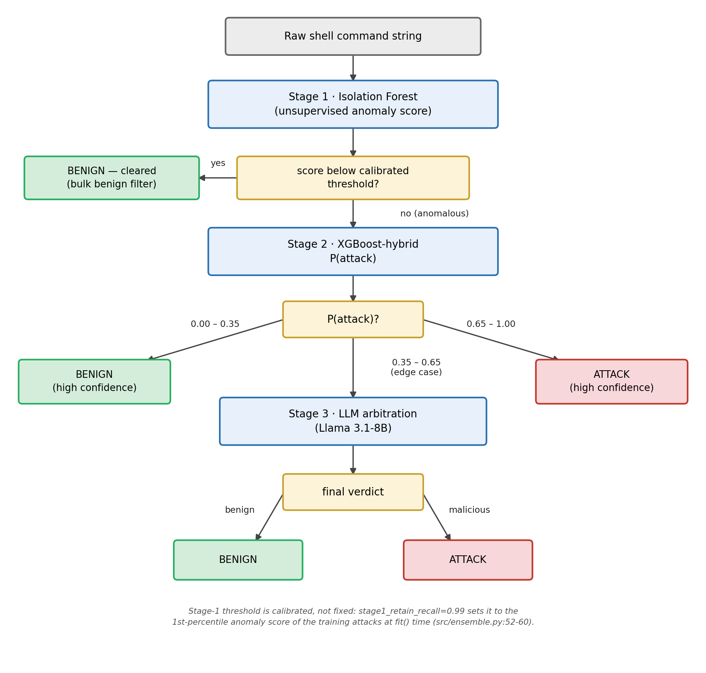

# Chapter 7 — Pipeline, Models and Hyperparameter Sensitivity

The shipped detector is the **three-stage cascade** of Figure 7.1. This chapter
specifies the five models it is built from and their hyperparameter sensitivity;
§8.4 ablates the cascade itself.

<!-- fig-width: 2.8 -->

**Figure 7.1 — Three-stage cascade detector.** Raw command → Isolation Forest
bulk-benign filter (stage 1) → XGBoost-hybrid (stage 2: P(attack) > 0.65 →
attack, < 0.35 → benign) → LLM arbitration on the 0.35–0.65 edge band. Bands are
the shipped `CascadeDetector` defaults (`src/ensemble.py`).

## 7.1 Explicit configuration, no library defaults

**Table 7.1 — The five shipped models (`src/models.py`): every value is explicit
at construction, none a library default.**

<!-- cols: 1.15 3.30 2.05 -->
| Model | Shipped hyperparameters | Imbalance remedy |
|---|---|---|
| `xgboost_hybrid` | `n_estimators=500, max_depth=7, learning_rate=0.1, subsample=0.9, colsample_bytree=0.7, reg_lambda=1.0`, char 3–5-grams × 3000 | `scale_pos_weight=3.0` |
| `xgboost` | `n_estimators=400, max_depth=6, learning_rate=0.1, subsample=0.9, colsample_bytree=0.9, reg_lambda=1.0` | `scale_pos_weight=3.0` |
| `cnn1d` | `max_len=256, embed_dim=32, n_filters=128, kernel_sizes=(3,5,7), dropout=0.3, lr=1e-3, epochs=8, batch_size=256, weight_decay=1e-5` | `pos_weight=3.0`, weighted cross-entropy |
| `random_forest` | `n_estimators=400, max_depth=24, min_samples_leaf=1, max_features="sqrt"` | `class_weight="balanced_subsample"` |
| `isolation_forest` | `n_estimators=300, max_samples=0.8, contamination=0.25, max_features=1.0` | fit on benign rows only |

**Imbalance is corrected cost-sensitively, never by resampling** — synthesis
would amplify the corpus's measured near-duplicate leakage (`docs/DATA_CARD.md`).
§8.4 ablates the resulting cascade.

## 7.2 Sensitivity: eleven axes, and only the operating-point dials move

**Table 7.2 — Eight of the eleven swept axes move F1 by under 0.029 on both
corpora; the three that move more are operating-point or mechanism artefacts.**
Bold marks the shipped value; the last two grids bracket rather than contain
theirs.

<!-- cols: 1.10 1.15 1.35 0.65 0.65 0.80 0.80 -->
| Model | Axis | Grid | ΔF1 D1 | ΔF1 D2 | FPR D1 | FPR D2 |
|---|---|---|---:|---:|---:|---:|
| `xgboost` | `max_depth` | 3, **6**, 9, 12 | 0.0042 | 0.0101 | .067–.079 | .075–.101 |
| `xgboost` | `learning_rate` | .03, **.1**, .3 | 0.0109 | 0.0141 | .072–.077 | .081–.088 |
| `xgboost` | `n_estimators` | 100, **400**, 800 | 0.0033 | 0.0094 | .072–.075 | .079–.091 |
| `xgboost` | `scale_pos_weight` | 1, **3**, 6 | 0.0245 | 0.0071 | .038–.108 | .049–.114 |
| `cnn1d` | `n_filters` | 64, **128**, 256 | 0.0143 | 0.0288 | .076–.082 | .074–.091 |
| `cnn1d` | `dropout` | .1, **.3**, .5 | 0.0212 | 0.0283 | .068–.076 | .089–.105 |
| `cnn1d` | `lr` | 5e-4, **1e-3**, 2e-3 | 0.0308 | 0.0419 | .076–.078 | .066–.091 |
| `cnn1d` | `pos_weight` | 1, **3**, 6 | 0.0242 | 0.0771 | .033–.119 | .042–.181 |
| `random_forest` | depth × trees (joint) | {10, 20, None} × {50…500} | 0.0205 | 0.0273 | .031–.053 | .052–.087 |
| `isolation_forest` | `contamination` | .05, .10, .20, .30 | 0.0925 | 0.1982 | .047–.287 | .029–.297 |

**The class-weight dial is a trade, not a gain.** Moving 1 → 6 multiplies FPR
2.8× (XGBoost D1) and 4.3× (CNN D2) to buy recall (CNN D2 0.770 → 0.898), and
weight 1 even scores ≤0.005 *higher* F1 in all four cells; the shipped 3.0, the
corpus's negative/positive ratio, buys 5.4 to 9.4 recall points at 1.7–2.3× the
false-alarm rate.

The CNN's `lr` swing is an artefact of the reduced sweep base (`max_len=192`, 4
epochs): its best point (0.8432 / 0.8333) loses to the shipped 8-epoch model
(0.8603 / 0.8384). `contamination` only sets a threshold — ROC-AUC is identical
to four decimals throughout (0.8120 / 0.6768). Fully grown Random Forest trees
lose to a depth cap (D1, n=500: 0.7850 / .0424 against 0.8006 / .0310), the one
library default these sweeps reject.

This is a sensitivity analysis, **not** a selection procedure: scored on the test
hold-out, no arg-max adopted, the hybrid's tree block never swept.

## 7.3 The validation protocol moved the numbers more than any hyperparameter

**Table 7.3 — Ungrouped 5-fold CV (`StratifiedKFold(n_splits=5, shuffle=True,
random_state=SEED)`) against the 80/20 hold-out grouped by command shape, F1.**
Positive Δ favours ungrouped; CNN rows are the sweep base
(`max_len=192`, 6 epochs), not the shipped model.

<!-- cols: 1.65 1.10 1.65 1.15 0.95 -->
| Model | Corpus | CV F1 (mean ± sd) | Hold-out F1 | Δ |
|---|---|---:|---:|---:|
| `xgboost_hybrid` | D1 | 0.8715 ± 0.0049 | 0.8761 | −0.0046 |
| `xgboost_hybrid` | D2 | 0.8752 ± 0.0092 | 0.8482 | **+0.0271** |
| `xgboost` | D1 | 0.7978 ± 0.0078 | 0.7856 | +0.0122 |
| `xgboost` | D2 | 0.7970 ± 0.0126 | 0.7557 | **+0.0412** |
| `cnn1d` | D1 | 0.8365 ± 0.0125 | 0.8495 | −0.0131 |
| `cnn1d` | D2 | 0.8262 ± 0.0104 | 0.8249 | +0.0012 |

**Dataset 1 agrees to within 0.0131, but Dataset 2's ungrouped estimate runs 2.7
to 4.1 points optimistic** for both tree models — 24% of its honeypot test rows
clear the loose 0.80 near-duplicate line against train (`docs/DATA_CARD.md`, an
upper bound), and XGBoost's 0.0412 gap there is nearly three times its largest
hyperparameter swing (0.0141). **Every headline figure here is the grouped
hold-out number**, the standard §8.3 holds ShellCore's ungrouped 10-fold protocol
to.
