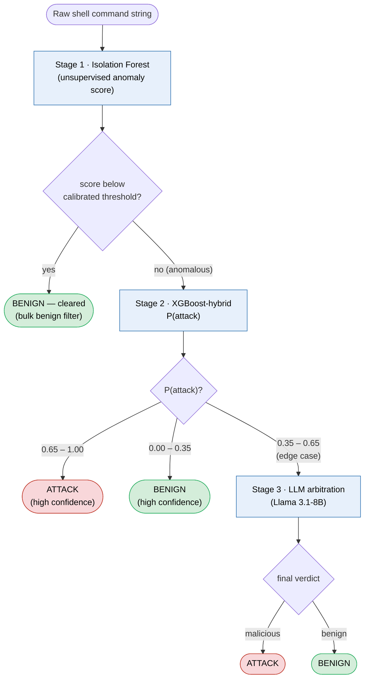

**Figure 7.1 — Three-stage cascade detector.** Raw command → Isolation Forest bulk-benign filter (stage 1) → XGBoost-hybrid classifier (stage 2: P(attack) > 0.65 → attack, < 0.35 → benign) → LLM arbitration (Llama 3.1-8B) on the 0.35–0.65 edge band.

> Thresholds are the shipped defaults: `CascadeDetector(stage2_uncertain=(0.35, 0.65))`
> in `src/ensemble.py:25`, passed explicitly at `analysis/ch8_4_cascade.py:63`. The
> stage-1 cut is not a literal — `stage1_retain_recall=0.99` overwrites it at `fit()`
> time with the 1st-percentile anomaly score of the training attacks
> (`src/ensemble.py:52-60`), which is why the decision node names a calibrated
> threshold rather than a number.
